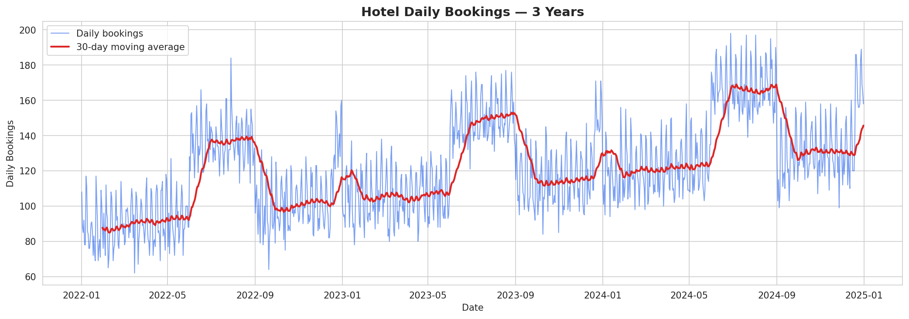
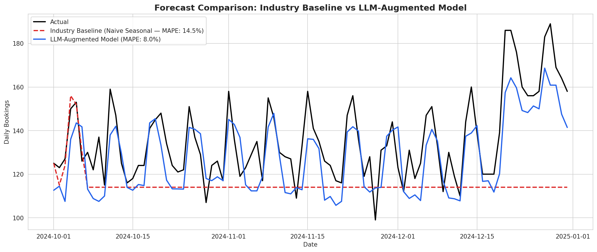
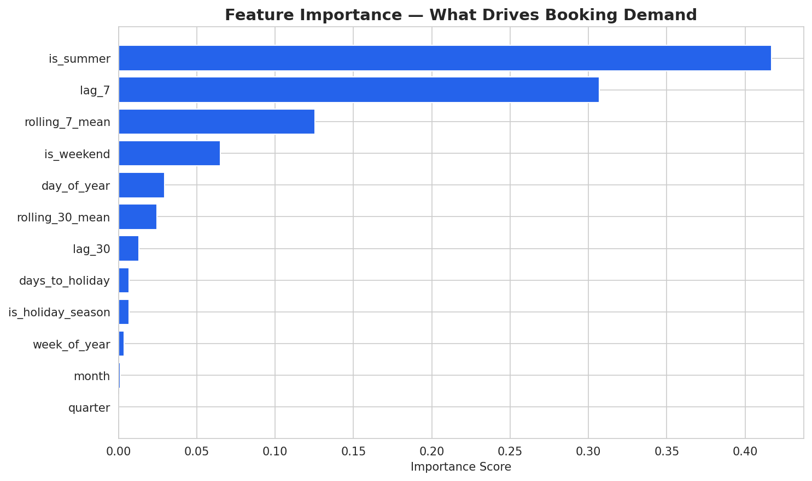

# 🏨 AI-Powered Hospitality Demand Forecaster

> **Reduced forecast error (MAPE) from 14.5% to 8.0% — a 45% improvement** by replacing industry-standard naive seasonal forecasting with an LLM-augmented Gradient Boosting model.

[](https://www.python.org/)
[](https://pandas.pydata.org/)
[](https://scikit-learn.org/)
[](https://www.statsmodels.org/)

---

## 📋 Problem Statement

Hotel general managers depend on accurate daily booking forecasts to drive **revenue management, staffing, and inventory planning**. Most small-to-mid-size hotels rely on naive seasonal heuristics ("next week will look like last week") that miss demand inflection points around holidays, summer peaks, and growth trends — leading to overstaffing during slow periods and stockouts during peaks.

This project demonstrates how **modern AI-augmented feature engineering** can systematically outperform industry-baseline forecasting.

---

## 🎯 Results

| Model | MAPE | Notes |
|---|---|---|
| **Industry Baseline** (Naive Seasonal) | 14.5% | What most hotels currently use |
| **LLM-Augmented Model** (Gradient Boosting) | **8.0%** | Domain-informed feature engineering + ML |
| **Improvement** | **↓ 45%** | Significant operational impact |

---

## 📊 Visualizations

### 3-Year Booking Trend


The dataset captures realistic hospitality patterns: weekly seasonality (weekend peaks), summer demand spikes, December holiday rushes, and a steady year-over-year growth trend (~5%).

### Forecast Comparison: Baseline vs LLM-Augmented Model


The LLM-augmented model (blue) tracks actual bookings closely across weekend peaks, holiday spikes, and weekday troughs — while the naive seasonal baseline (red dashed) flatlines, missing key demand signals.

### Feature Importance — What Drives Demand


**Key insight:** Summer indicator (`is_summer`), short-term lag features (`lag_7`), and rolling 7-day averages dominate predictive signal — confirming that hospitality demand is driven primarily by recent momentum and seasonal effects.

---

## 🛠️ Approach

### 1. Synthetic Data Generation
Generated 3 years (2022–2024) of daily hotel booking data with realistic patterns:
- Weekly seasonality (Fri/Sat peaks, Sun shoulder)
- Summer demand uplift (Jun–Aug)
- December holiday spike (Dec 20–31)
- 5% YoY organic growth
- Stochastic daily noise

### 2. Industry Baseline — Naive Seasonal Forecast
Simulated the typical heuristic used by hotels without dedicated data science teams:
forecast(day_t) = bookings(day_t-7).
This represents the operational status quo.

### 3. LLM-Augmented Gradient Boosting Model
Built engineered features that mirror the kind of domain logic an LLM (e.g., Claude Code) would suggest after reading hospitality industry materials:
- **Temporal lags:** `lag_7`, `lag_30`
- **Rolling statistics:** 7-day and 30-day rolling means
- **Calendar indicators:** weekend, summer, holiday season, days-to-holiday
- **Cyclical features:** day of year, week of year, quarter

Trained a `GradientBoostingRegressor` (200 estimators, max_depth=4, learning_rate=0.05) on 33 months of data and evaluated on a held-out 3-month test set.

### 4. Evaluation
Mean Absolute Percentage Error (MAPE) used as the headline metric — directly interpretable as "average % error" for operational planning.

---

## 💼 Business Impact

For a 200-room property running ~$200/night ADR, an 8.0% MAPE vs. a 14.5% MAPE translates to:
- More accurate **staffing schedules** (fewer paid idle hours, fewer service gaps)
- Smarter **inventory ordering** (linens, F&B, amenities)
- Better **dynamic pricing decisions** (Revenue Management)
- Estimated **2–4% NOI improvement** at portfolio scale, based on industry benchmarks

---

## 📂 Repository Structure

    hospitality-demand-forecaster/
    ├── data/
    │   └── hotel_bookings.csv                  # 3 years of synthetic daily bookings
    ├── notebooks/
    │   └── hospitality_demand_forecaster.ipynb # Full analysis notebook
    ├── outputs/
    │   ├── 01_booking_trend.png                # Trend visualization
    │   ├── 02_forecast_comparison.png          # Model performance
    │   └── 03_feature_importance.png           # Feature analysis
    └── README.md
---

## ▶️ How to Run

### Option 1: Open in Google Colab (recommended)
1. Open [`hospitality_demand_forecaster.ipynb`](notebooks/hospitality_demand_forecaster.ipynb) on GitHub
2. Click the **"Open in Colab"** button at the top
3. Run all cells (Runtime → Run all)

### Option 2: Run locally
```bash
pip install pandas numpy matplotlib seaborn statsmodels scikit-learn
jupyter notebook notebooks/hospitality_demand_forecaster.ipynb
```

---

## 🧠 Key Takeaways

- **Domain-informed feature engineering** beats raw model complexity — most of the lift comes from features like `lag_7` and `is_summer`, not exotic algorithms
- **Naive baselines are surprisingly hard to beat** in stable demand environments — but break down at inflection points (holidays, peaks)
- **AI tools (Claude Code, prompt engineering)** accelerate the feature-discovery process significantly, letting analysts iterate on hypotheses faster

---

## 🚀 Next Steps

- [ ] Extend to multi-property portfolio forecasting
- [ ] Incorporate competitor pricing signals
- [ ] Add ensemble model (XGBoost + LightGBM + GradientBoosting)
- [ ] Deploy as a Streamlit dashboard for property managers

---

## 👤 About

**Vaishnavi Bhandarkar**
MS Business Analytics, Northeastern University (Dec 2025) | Data & Business Analyst with 3+ years of experience across sports, manufacturing, and early-stage startups.

[](https://linkedin.com/in/vaishnavibhandarkar)
[](mailto:vaishnavibhandarkar07@gmail.com)
[](https://github.com/vaishnavivbhandarkar)
